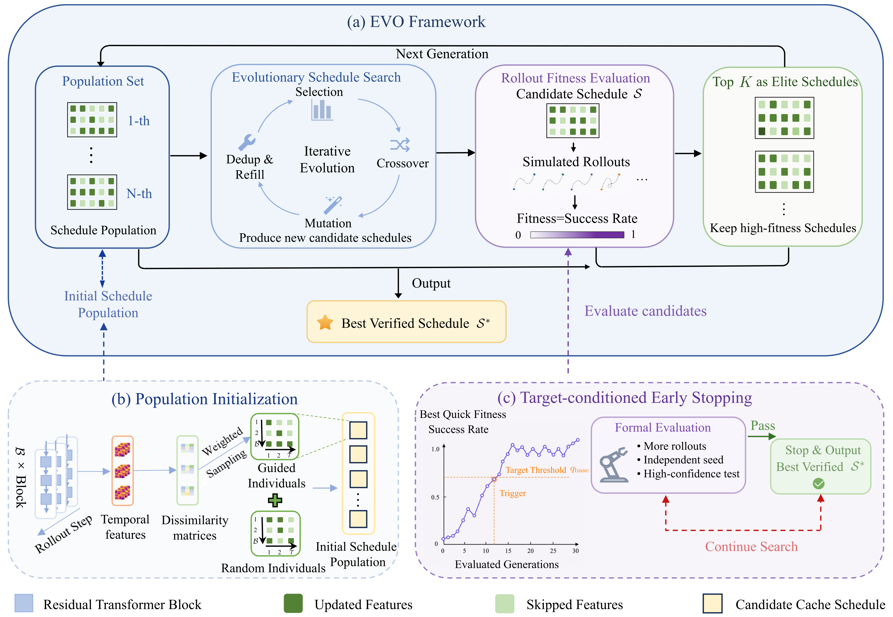

# Evolving Cache Schedules for Fast Diffusion Policy Inference

### Training-Free Global Cache Scheduling via Evolutionary Search




---

## Overview

Evolving Cache Schedules (EVO) accelerates transformer-based Diffusion Policy by offline-optimizing a global cache schedule over the block–timestep lattice with an evolutionary algorithm and reusing residual caches during iterative denoising. With redundancy-aware initialization and target-conditioned early stopping, EVO targets the closed-loop action generation bottleneck where uniform computation allocation fails to exploit heterogeneous redundancy across transformer blocks and denoising steps.

---

## Overview

Evolving Cache Schedules (EVO) accelerates transformer-based Diffusion Policy by offline-optimizing a global cache schedule over the block–timestep lattice with an evolutionary algorithm and reusing residual caches during iterative denoising. EVO targets the closed-loop action generation bottleneck in visuomotor control, where uniform computation allocation fails to exploit heterogeneous redundancy across transformer blocks and denoising steps.

---

## Key Features

- **Global Cache Scheduling:** Offline-optimized cache schedule that allocates refresh positions over the full block–timestep lattice under a fixed computation budget.  
- **Rollout-driven Evolutionary Search:** Evolutionary search framework that optimizes complete cache schedules using closed-loop rollout performance as the fitness.  
- **Practical Search Mechanisms:** Redundancy-aware initialization and target-conditioned early stopping that reduce the cost of rollout-based schedule search.  
- **Plug-and-Play Acceleration:** Wraps pretrained Diffusion Policy checkpoints without updating policy parameters, modifying the diffusion sampler, or changing the action interface.  

---

## Installation

```bash
git clone --recursive https://anonymous.4open.science/r/EVO.git
cd EVO

conda env create -f conda_environment.yaml
conda activate robodiff

pip install -e .
```

If the repository has already been cloned without submodules, initialize Diffusion Policy with:

```bash
git submodule update --init --recursive
```

This implementation targets transformer-based Diffusion Policy checkpoints. Please also prepare the benchmark-specific dependencies required by the corresponding Diffusion Policy environments.

---

## Simulation Reproduction

The EVO inference and offline schedule-search code is located in `EVOInfer/`. It is designed to work with pretrained transformer-based Diffusion Policy checkpoints and datasets from the original Diffusion Policy project.

Supported benchmark tasks include `can_ph`, `can_mh`, `lift_ph`, `lift_mh`, `square_ph`, `square_mh`, `transport_ph`, `transport_mh`, `tool_hang_ph`, `kitchen`, `blockpush`, and `pusht`.

### Step 1: Prepare Diffusion Policy Data and Checkpoints

Download datasets and pretrained checkpoints following the Diffusion Policy instructions. By default, this code expects checkpoints under:

```text
checkpoint/<task_name>/diffusion_policy_transformer/train_<id>/checkpoints/latest.ckpt
checkpoint/low_dim/<task_name>/diffusion_policy_transformer/train_<id>/checkpoints/latest.ckpt
```

You can also pass an explicit checkpoint path to each script.

Large datasets, pretrained checkpoints, generated schedules, and rollout logs are not included in this repository.

### Step 2: Prepare Activation-Dissimilarity Priors

```bash
python -m EVOInfer.scripts.prepare_importance \
  --task kitchen \
  --checkpoint auto \
  --output_dir results/evo_search/kitchen/importance \
  --device cuda:0 \
  --sample_steps 5
```

The generated activation and pair-importance files are saved under `results/evo_search/<task>/importance/`.

### Step 3: Search an EVO Cache Schedule

```bash
python -m EVOInfer.scripts.search_schedule \
  --config EVOInfer/search_config/default_search.yaml \
  --task kitchen \
  --output_dir results/evo_search/kitchen/schedule \
  --device cuda:0 \
  --init_pair_importance_path results/evo_search/kitchen/importance/pair_importance_kitchen.json
```

The default search configuration in `EVOInfer/search_config/default_search.yaml` follows the paper setting: 192 cached block-timestep pairs, population size 50, 10 elites, mutation rate 0.1, crossover rate 0.8, maximum 100 generations, and 50 formal evaluation rollouts. Search results are saved under `results/evo_search/<task>/schedule/`, including `evo_search_results.json` and `evo_schedule.json`.

### Step 4: Evaluate EVO

```bash
python -m EVOInfer.scripts.eval_evo \
  --task kitchen \
  --output_dir results/evo_eval/kitchen/evo \
  --device cuda:0 \
  --cache_mode evo \
  --pairs_path results/evo_search/kitchen/schedule/evo_schedule.json \
  --num_inference_steps 100 \
  --skip_video
```

Baseline evaluation without caching:

```bash
python -m EVOInfer.scripts.eval_evo \
  --task kitchen \
  --output_dir results/evo_eval/kitchen/original \
  --device cuda:0 \
  --cache_mode original \
  --skip_video
```

The evaluation script reports latency, speedup, FLOPs estimates, and closed-loop rollout performance.

## Project Structure

```text
EVO/
|-- EVOInfer/                         # EVO inference and offline schedule-search code
|   |-- acceleration/                 # Runtime wrapper for applying verified EVO schedules
|   |-- search/                       # Evolutionary search, activation dissimilarity, and schedule utilities
|   |-- search_config/                # Default search configuration
|   |-- scripts/                      # Entrypoints for prior preparation, schedule search, and evaluation
|   `-- utils/                        # Path resolution and task/checkpoint utilities
|-- diffusion_policy/                 # Base Diffusion Policy implementation (submodule or external dependency)
|-- figure/                           # Method framework and visualization figures
|-- checkpoint/                       # Pretrained Diffusion Policy checkpoints (not included)
|-- importance_data/                  # Generated activation and importance artifacts (not included)
|-- results/                          # EVO search outputs, evaluation outputs, and rollout logs (not included)
|-- conda_environment.yaml            # Reproduction environment
|-- setup.py                          # Python package setup
`-- README.md                         # Project documentation
```

---

## License

This project is released under the MIT License. See `LICENSE` for details.
